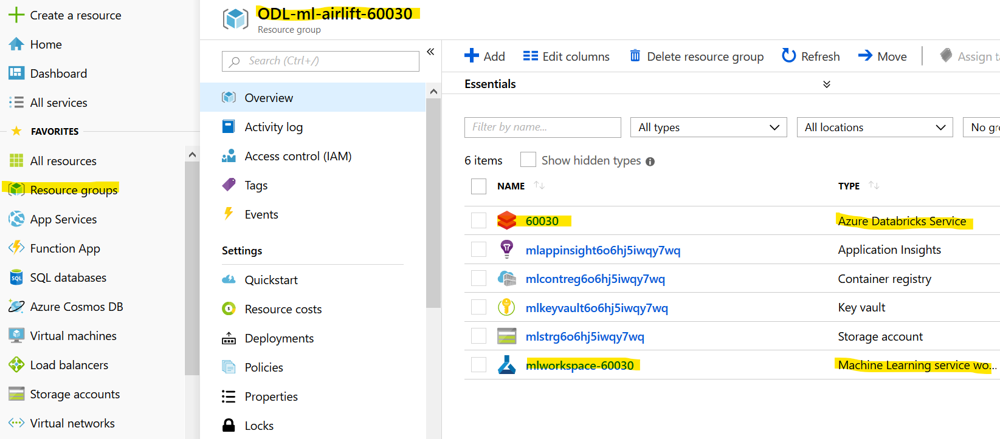
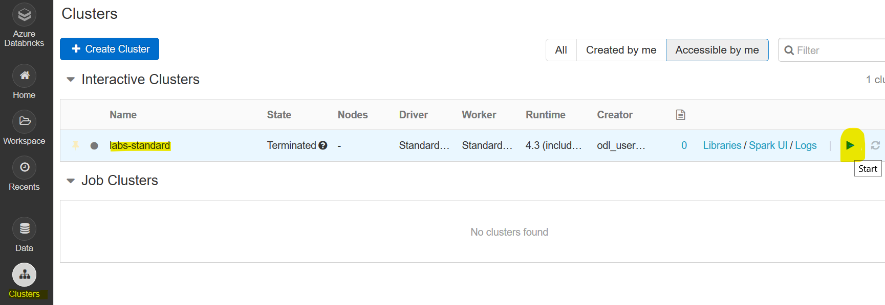
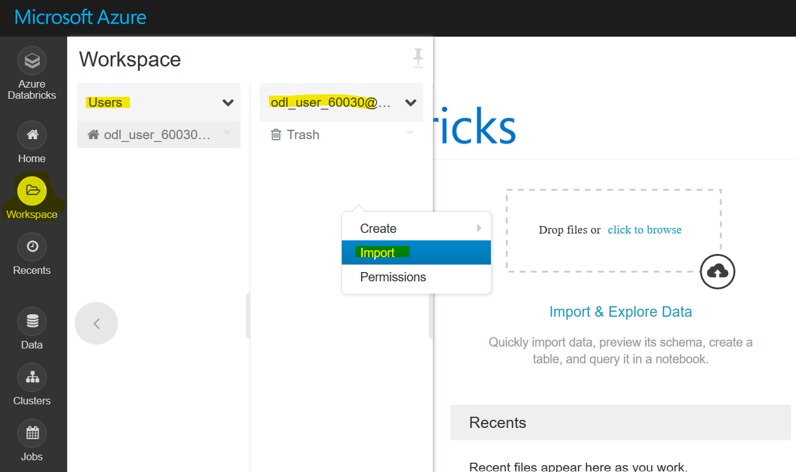
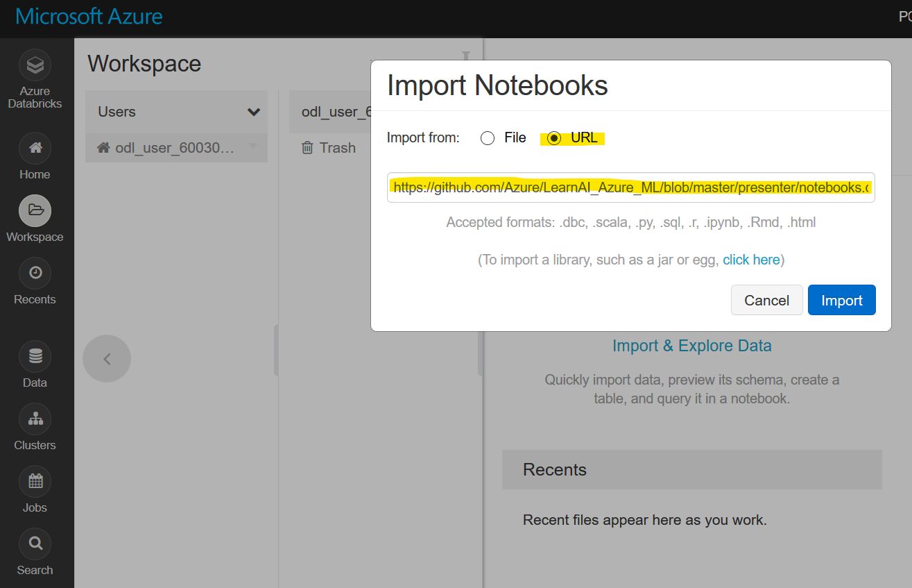
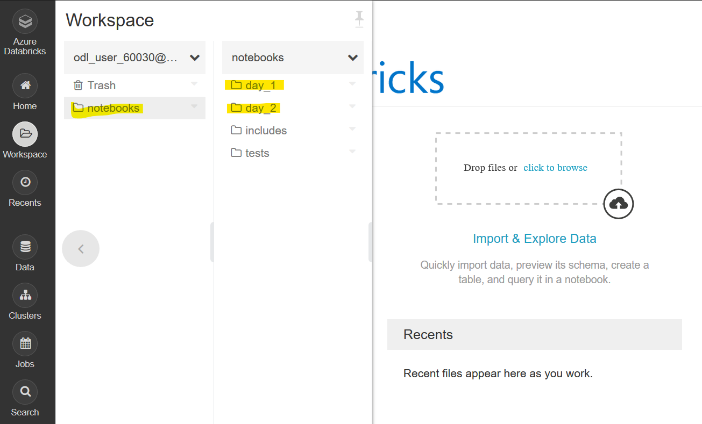
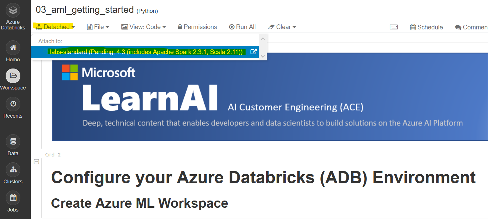
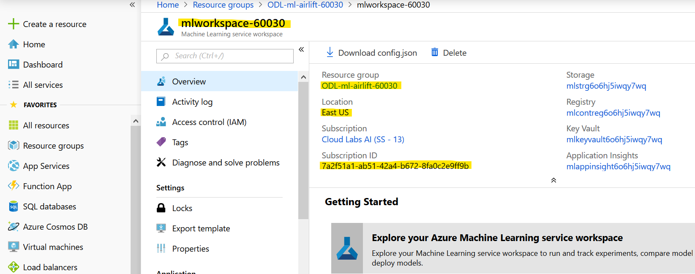
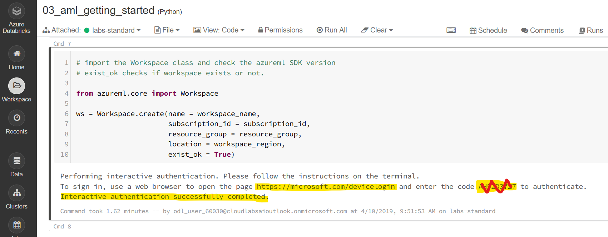

## Azure Machine Learning SDK and Automated ML on Azure Databricks

Welcome and let's get started!

1) Please visit this page to provision your lab envirnoment. I recommend opening your browser in private/incognito mode to run the labs today.
[http://bit.ly/2JY5BXK](http://bit.ly/2JY5BXK)
Please keep the page with the credentials open. If you close it by accident, go to your email to find a link.
2) In a separate tab, log into [http://portal.azure.com/](http://portal.azure.com/) using the username and password provided for the lab.
3) From the Azure portal, click on **Resource groups** and click on the one resource group provisioned for you (should have prefix `ODL-ml-airlift`). It contains several resources including an `Azure Databricks Service` and an `Azure Machine Learning service workspace`. Click on the `Azure Databricks service` and on **Launch Workspace**. This will open a separate tab and you will automatically get logged in using your Azure credentials.

4) On the Databricks portal, click on **Clusters** and press the play button to start the cluster called `labs-standard`, then confirm. 

It will take a few minutes to start your cluster.
5) On the Databricks portal, click on **Workspace**, **Users**, and then on your user name, then right-click on the blank canvas and select **Import**.

Select URL for importing, then copy and paste `https://github.com/Azure/LearnAI_Azure_ML/blob/master/presenter/notebooks.dbc` into the box and choose **Import**.

You should now see a folder called `notebooks` appear in your user folder with the course contents.

6) On the Databricks portal, navigate to `notebooks/day_2` and open the notebook called `03_aml_getting_started`. Prior to running the notebook you need to attach the cluster to it. Click on **Detached** and select the cluster to attach it.

You can now begin running this notebook from the top. There are two things to note as you run through this notebook:
  - In one of the cells, you will be asked to paste in your subscription ID, resource group, workspace name and region. You can get all this information by returning to the [Azure portal](http://portal.azure.com/) tab and clicking on your `Azure Machine Learning service workspace` resource (see step 2).
  
  Replace the workspace name and resource group with the ones you see on the portal. For the region, please use **one word all lower-case**, e.g. `eastus`.
  - When you run the cell that creates your AML Workspace, you will be asked to go to the URL [https://microsoft.com/devicelogin](https://microsoft.com/devicelogin) and enter the code you are provided. Please do so. Once you authenticate you can return to the Databricks portal and see a confirmation message.
  

When you return in the afternoon, you will run the following notebooks (in the following order):
- `day_1/02_feature_engineering`
- `day_2/05_automated_ML`
- `day_2/06_deployment`
