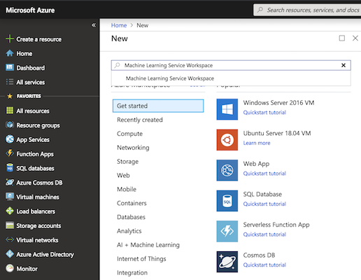
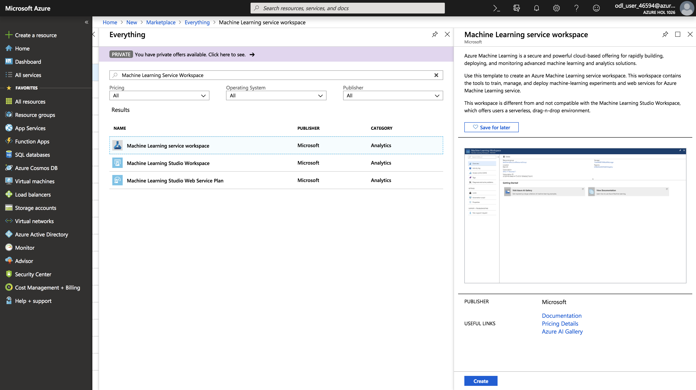
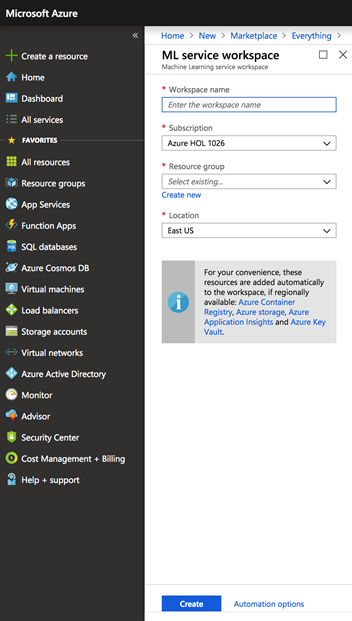
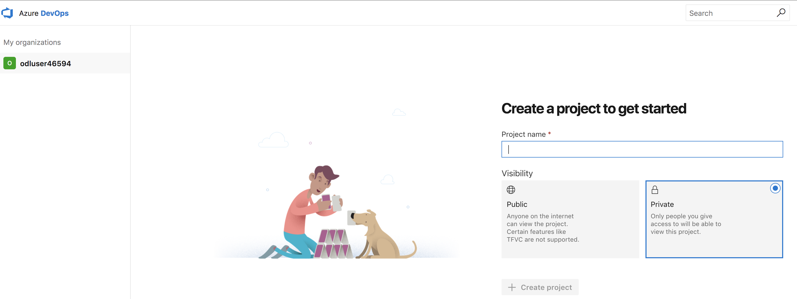
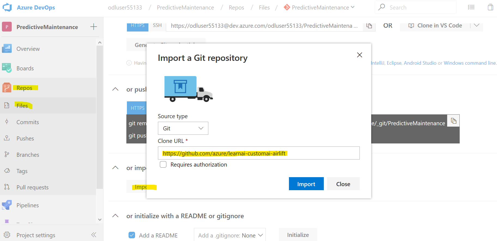

# Setup

This lab allows you to perform setup for building a Continuous Integration/Continuous Deployment pipeline related to Anomoly Detection and Predictive Maintenance. 

### Pre-requisites

- Azure account
- Azure DevOps Account
- Azure Machine Learning Service Workspace
- Basic knowledge of Python

After you launch your environment, follow the below steps:

### Azure Machine Learning Service Workspace

We will begin the lab by creating a new Machine Learning Service Workspace using Azure portal:

1. Login to Azure portal using the credentials provided with the environment.

2. Select `Create a Resource` and search the marketplace for `Machine Learning Service Workspace`.

3. Select `Machine Learning Service Workspace` followed by `Create`:

4. Populate the mandatory fields (Workspace name, Subscription, Resource group and Location):

### Sign in to Azure DevOps

Go to https://dev.azure.com and login using the username and password provided. After logging in, you should see the below:

### Create a Project

Create a Private project by providing a `Project name`. With private projects, only people you give access to will be able to view this project. Select `Create` to create the project.

### Create Service connection

The build pipeline for our project will need the proper permission settings so that it can create a remote compute target in Azure.  This can be done by setting up a `Service Connection` and authorizing the build pipeline to use this connection.

> If we didn't set up this `service connection`, we would have to interactively log into Azure (e.g. az login) everytime we run the build pipeline.

Setting up a service connection involves the following steps:
1. Click on `Project settings` in the bottom-left corner of your screen.
1. On the next page, search for menu section `Pipelines` and select `Service Connection`.
1. Create a `New service connection`, of type `Azure Resource Manager`.
1. Properties of connection:
   1. `Service Principal Authentication`
   1. **Important!** Set `connection name` to "serviceConnection" (careful about capitalization).
   1. `Scope level`: Subscription
   1. `Subscription`: Select the same which you have been using throughout the course. You may already have a compute target in there (e.g. "aml-copute") and a AML workspace.
   1. **Important!** Leave `Resource Group` empty.
   1. Allow all pipelines to use this connection.

### Repository

After you create your project in Azure DevOps, the next step is to clone our repository into your DevOps project. The simplest way is to import using the `import` wizard found in Repos -> Files -> Import as shown below. Provide the clone url (https://github.com/azure/learnai-customai-airlift) in the wizard to import.

After running the above steps, your repo should now be populated and would look like below:

